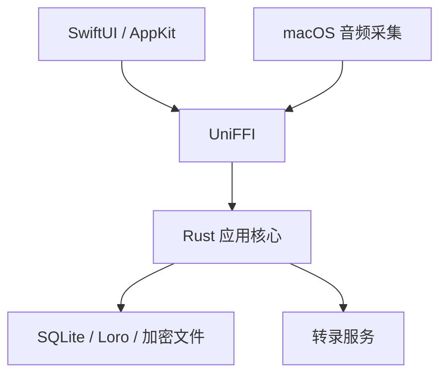

# Zulangue 架构

Zulangue 采用 Rust 核心与原生 macOS 界面分层结构。

## 职责

- SwiftUI/AppKit：窗口、布局、焦点、辅助功能、权限提示和音频采集。
- UniFFI：在 Swift 与 Rust 之间传递类型化命令、查询和事件。
- Rust：录音会话状态、用户授权检查、转录协议、持久化、投影、任务和删除。
- SQLite、Loro 与加密文件：保存结构化数据、可编辑文档和音频内容。

## Notebook

每个 Notebook 包含实时转录、异步转录和手写笔记。一次录音或导入对应一个
session。转录投影只能写入对应的转录文档，不能写入手写笔记。

## 录音与转录

macOS 音频适配器把采集到的音频交给 Rust 会话。Rust 负责会话生命周期、本地
写入、转录服务连接、结果排序和持久化。界面只展示 Rust 状态的投影，不维护
第二套录音状态机。

远程处理必须绑定到明确的用户操作。保存凭据、启动应用或打开 Notebook 都不
构成发送音频或上下文的授权。

## 本地数据

- SQLite 保存 Notebook、session、转录事实和运行状态。
- Loro 保存可编辑文档。
- 音频与 Context Pack 内容使用本地加密文件。
- 服务凭据保存在应用私有目录，不进入仓库、日志或数据库。

## 代码边界

- `crates/vt-ffi` 是 Swift 调用 Rust 的入口。
- `crates/vt-store` 负责持久化。
- `crates/vt-stt` 负责转录服务协议。
- `crates/vt-audio` 负责音频处理。
- `macos/Zulangue/Zulangue` 负责 macOS 应用。

修改跨语言接口后，应重新生成 UniFFI 绑定并运行完整本地门禁。
