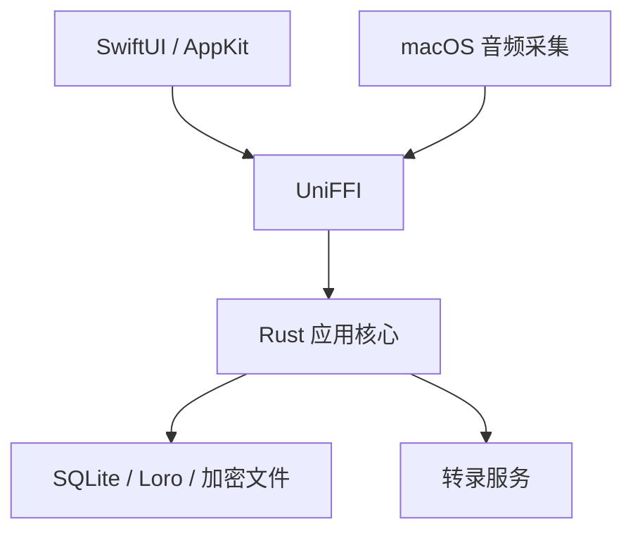

# Zulangue 架构

Zulangue 采用 Rust 核心与原生 macOS 界面分层结构。

## 职责

- SwiftUI/AppKit：窗口、布局、焦点、辅助功能、权限提示和音频采集。
- UniFFI：在 Swift 与 Rust 之间传递类型化命令、查询和事件。
- Rust：录音会话状态、用户授权检查、转录协议、持久化、投影、任务和删除。
- SQLite、Loro 与加密文件：保存结构化数据、可编辑文档和音频内容。

## Notebook

每个 Notebook 固定包含四个内建标签：
`realtime_transcript`、`async_transcript`、`manual_note` 和 `resources`。
标签是固定视图，不是 Session，也不是用户自定义分类。

一次录音或导入对应一个 Session。创建 Session 时建立稳定的资源集合，所有资源
共享同一个 `session_id`：

- `realtime_transcript` 保存该 Session 的实时转录投影。
- `async_transcript` 保存该 Session 的异步转录投影与任务状态。
- `manual_note` 查询该 Notebook 的线性时间笔记流。每条记录代表某个时间点形成的
  一份完整笔记，包含可空标题、正文、不可因重命名而改变的创建时间、更新时间和
  可选的 `session_id`。标题命名整份时间笔记，不命名内部段落或资源文件。
- `resources` 查询该 Session 的文件清单与状态，不创建第四份正文。

实时与异步标签按 Session 的录音时间线性查询对应文件；个人笔记按笔记创建时间
线性查询，并支持连续滚动。资源标签按 Session 分组显示音频、转录与笔记资源，
状态至少区分 `missing`、`pending`、`ready` 和 `failed`。

标签级容器负责聚合，Session 级文件负责隔离内容。转录任务只能写入对应 Session
的转录文件，不能写入个人笔记。

## 转录编辑所有权

SQLite 中的 provider token、utterance 事实和异步结果保留机器原文。Loro 文档是
可编辑投影。每个可编辑段必须带稳定的 `session_id`、`utterance_id` 和
`lane_language` 标记。

自动投影只拥有 `completion = partial` 的临时内容以及尚未被用户修改的完整 lane。
用户主动提交修改时，在 Loro lane 上写入用户所有权标记。之后的投影按稳定
utterance/lane 增量更新，遇到用户所有的 lane 必须跳过；不能通过重建整个 Session
区段覆盖它。机器原文和用户文本因此可以同时保留。

## 录音与转录

macOS 音频适配器把采集到的音频交给 Rust 会话。Rust 负责会话生命周期、本地
写入、转录服务连接、结果排序和持久化。界面只展示 Rust 状态的投影，不维护
第二套录音状态机。

远程处理必须绑定到明确的用户操作。保存凭据、启动应用或打开 Notebook 都不
构成发送音频或上下文的授权。

## 本地数据

- SQLite 保存 Notebook、session、转录事实和运行状态。
- Loro 保存可编辑文档。
- 音频与 Context Pack 内容使用本地加密文件。
- 服务凭据保存在应用私有目录，不进入仓库、日志或数据库。

## 代码边界

- `crates/vt-ffi` 是 Swift 调用 Rust 的入口。
- `crates/vt-store` 负责持久化。
- `crates/vt-stt` 负责转录服务协议。
- `crates/vt-audio` 负责音频处理。
- `macos/Zulangue/Zulangue` 负责 macOS 应用。

修改跨语言接口后，应重新生成 UniFFI 绑定并运行完整本地门禁。
